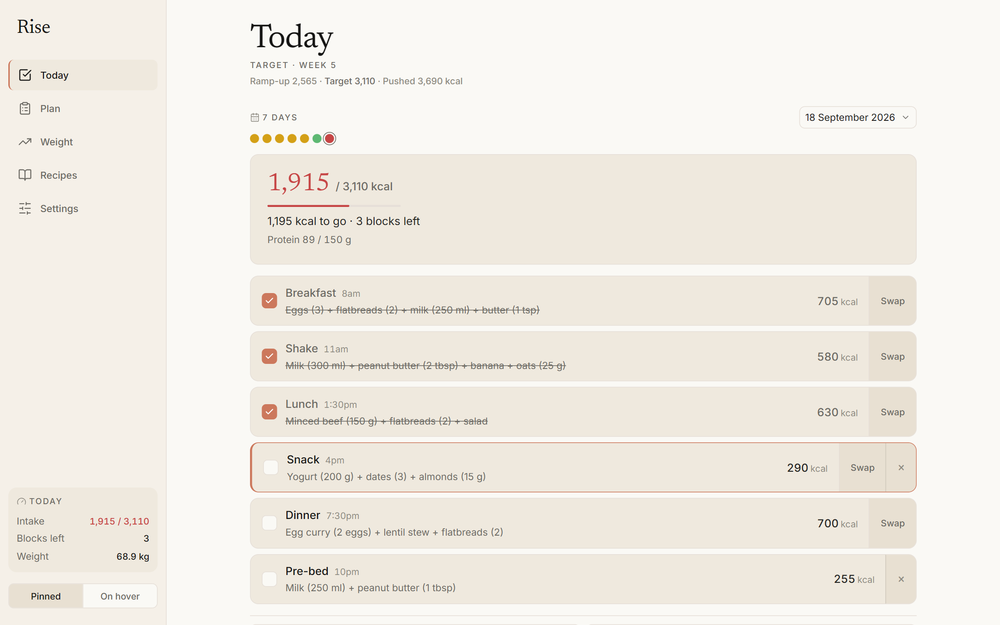
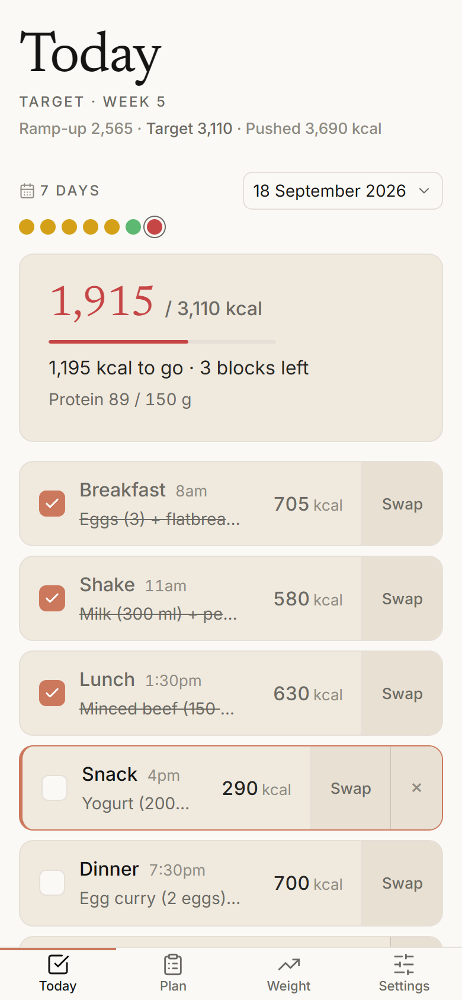
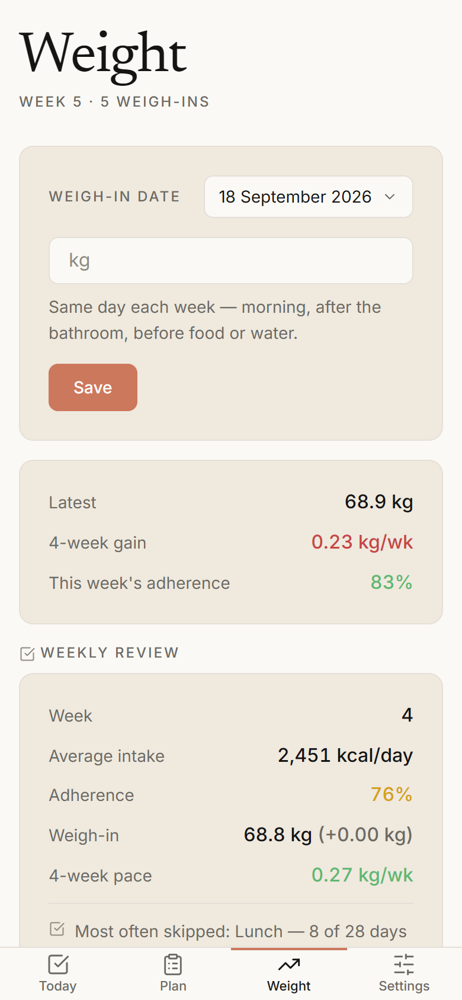
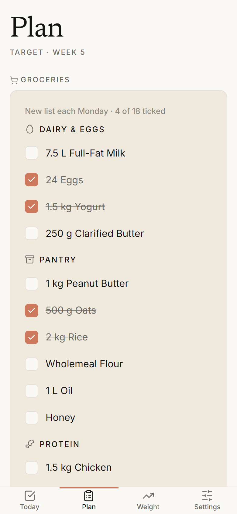
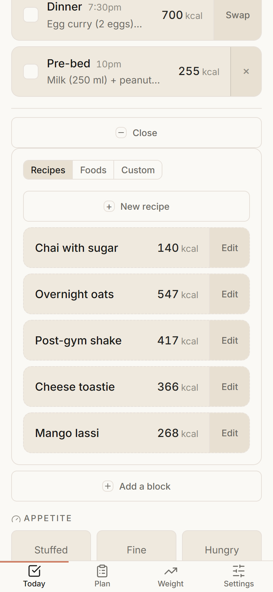
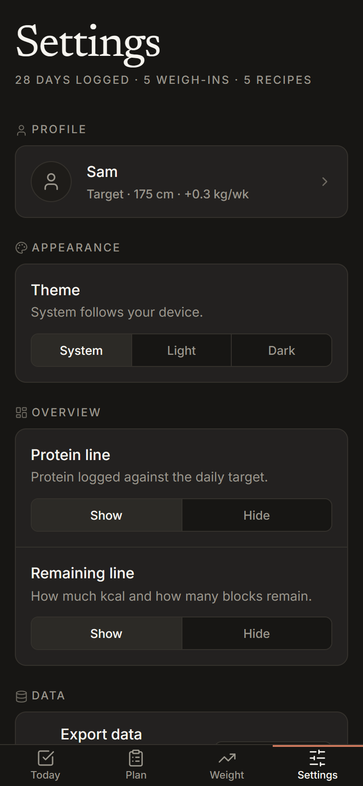

# Rise: Diet Tracker 🍳

**a diet tracker and planner.** local-first, offline, no accounts.

**live:** <https://rvyyv-n.github.io/diet-tracker/> — open it, then "Add to Home
Screen" (mobile) or "Install app" (desktop) for the standalone, offline PWA.

```
status: v2.2.0 — meal reminders on the web, Windows and Android
built:  fixed meal blocks + phase ladder, weight trend + adjustment engine,
        off-plan food + recipe book (its own screen on desktop), weekly
        grocery checklist, desktop layout, dark mode, json export/import,
        installable offline pwa, android apk + windows installer
next:   device checks of the reminders; android pwa install check (non-blocking)
```



## the idea

most diet apps make you weigh and log every item you eat, and most people quit
within a fortnight. this one inverts that: the plan is fixed in advance as a set
of meal **blocks**, and the only daily action is ticking the ones you ate.
calories and protein come from the blocks — no ingredient is ever logged.

a weekly weigh-in feeds a four-week rolling average, and an engine *suggests*
plan adjustments rather than applying them. the plan that ships aims at a slow,
steady weight gain; the block structure generalises to any fixed plan.

- **no food logging** — adherence tracking, not nutrition accounting
- **works offline** — everything is cached; fonts vendored, data stays in your
  browser. only two things ever touch the network, and neither sends diet
  data: the update check (a version lookup against the GitHub API, on a
  manual tap or at most weekly), and web meal reminders if you turn them on
  (the push server stores only a push address, a timezone and the meal times)
- **never nags** — a missed block is a number, not a guilt trip
- **nothing personal in this repo** — your details are entered on first run

## screens

<p>
  
  
  
  
  
</p>

- **today** — the day's active blocks as tap rows; running kcal + protein, an
  intake-status colour, an inline rotation picker per meal, a way to add or drop
  a block for the day, off-plan food logged by name and kcal, a one-tap
  appetite check, and any adjustment suggestion with apply / dismiss
- **weight** — a weigh-in (any date, through a calendar popover), the four-week
  gain against the target band, a trend chart, and an editable history
- **plan** — the weekly grocery checklist and the phase target ladder, with a
  link through to recipes
- **recipes** — a reusable recipe book for off-plan meals, every meal option
  in the plan, and the food table (in the side nav on desktop; on a phone,
  reached from plan, and the book alone from Today's log food panel)
- **settings** — the profile card (tap to edit), theme, overview metrics, meal
  reminders (on iPhone and iPad, once Rise is added to the Home Screen),
  json export / import with a preview, a check-for-updates row, and
  a data reset behind a confirm

## install

Rise is a PWA — no App Store, no Play Store. Open the live URL and add it to
your device; it then launches standalone and works with no signal.

**iPhone / iPad**

1. Open <https://rvyyv-n.github.io/diet-tracker/> in **Safari** — only Safari
   can install a web app on iOS, not Chrome or Firefox.
2. Tap the **Share** button (square with an upward arrow).
3. Scroll down, tap **Add to Home Screen**, then **Add**.
4. Launch it from the new **Rise** icon. It opens full-screen with no browser
   bars and keeps working offline.

Meal reminders need this step on iOS: Safari only delivers web notifications
to an app added to the Home Screen, never to a tab.

iOS can clear an unused web app's storage after roughly a week offline. Rise
requests persistent storage on first run to avoid that, and **Settings →
Export data** is the manual backup.

**Android**

Open the URL in Chrome, then take the **Install app** prompt, or
**⋮ menu → Add to Home screen → Install**.

**Desktop**

Open the URL and click the **install icon** at the right of the address bar, or
**⋮ menu → Install Rise…**. It opens in its own window. On a Mac, Safari's
**File → Add to Dock** does the same.

**Standalone installers**

For a self-contained copy that doesn't depend on the Pages URL staying up,
grab the Android APK or the Windows installer from the
[latest release](https://github.com/rvyyv-n/diet-tracker/releases/latest).
Both are unsigned (no code-signing certificate), so Android/Windows will
warn before the first install/run — that's expected, not a sign anything's
wrong. Neither updates in place, but the app checks GitHub for a newer
release and links you straight to it (**Settings → Check for updates**, also
run automatically at most weekly). Data doesn't carry over between this and a
browser-installed copy — use **Settings → Export/Import data** to move it.

## built with

React 19 + Vite, with `motion` for animation; no backend for diet data — it
stays in the browser's storage. the Android app is a Kotlin WebView shell, the Windows
app is Tauri, and web reminders go through a small Cloudflare Worker.

## structure

```
index.html        app shell — loads the entry script, registers the service worker
src/*.jsx         one React component per screen, plus the app shell
src/js/core/      storage, profile, the plan + day + weight models, the trend
                  and adjustment engines — all pure, no dom
src/js/ui/        small shared controls (popover, listbox, date pickers, icons)
src/css/          design tokens, then the screen + component styles
public/           manifest.json, sw.js, the app icon and vendored typefaces —
                  copied to the build root untouched
android/          the Android shell and its native reminders
desktop/          the Tauri desktop shell: tray, start with Windows, reminders
server/           the Cloudflare Worker behind web push reminders
docs/             design system, plan spec, changelog and roadmap
```

## running it

needs Node 24. `npm install`, then `npm run dev`. `file://` won't work — es
modules need http, and Vite serves over it. `npm run build` produces the
deployable `dist/`, and `npm run preview` serves that build locally. the
service worker caches aggressively; while developing, hard-reload or bump
`CACHE_NAME` in `public/sw.js` to pick up changes. the native shells have their
own build notes in [`android/README.md`](android/README.md) and
[`desktop/README.md`](desktop/README.md), and the reminder server in
[`server/README.md`](server/README.md).

## roadmap

what's shipped, release by release, is in [docs/CHANGELOG.md](docs/CHANGELOG.md);
what's still unbuilt is in [docs/roadmap.md](docs/roadmap.md).

## license

mit — see [LICENSE](LICENSE)
