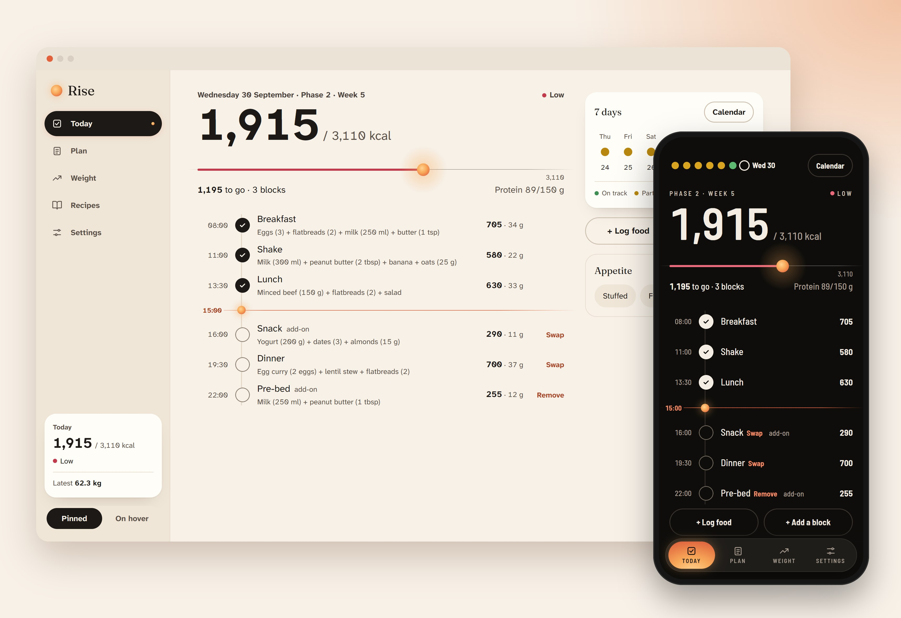
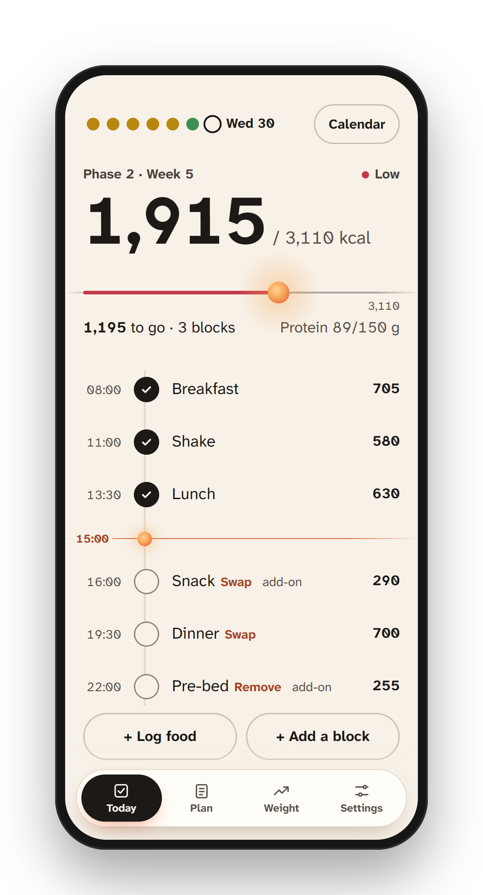
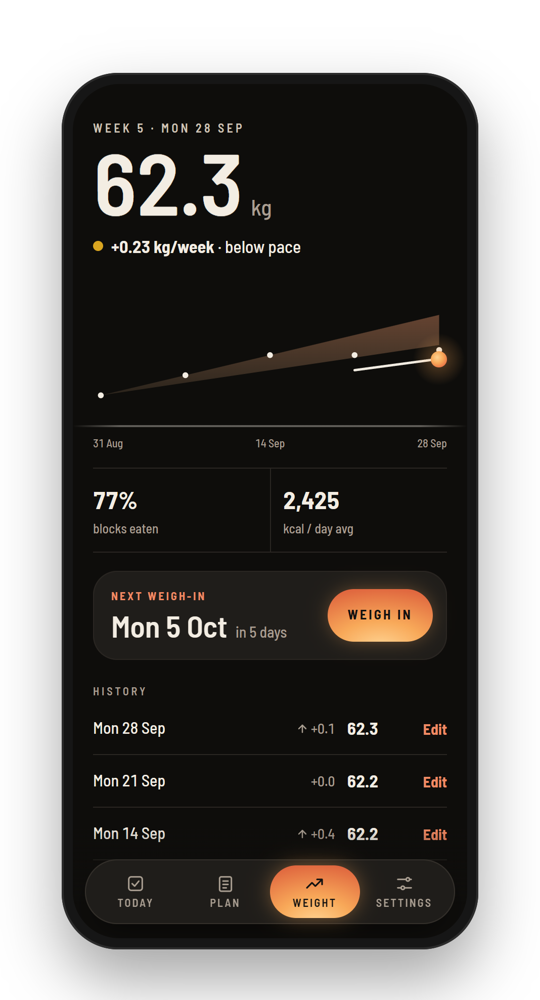
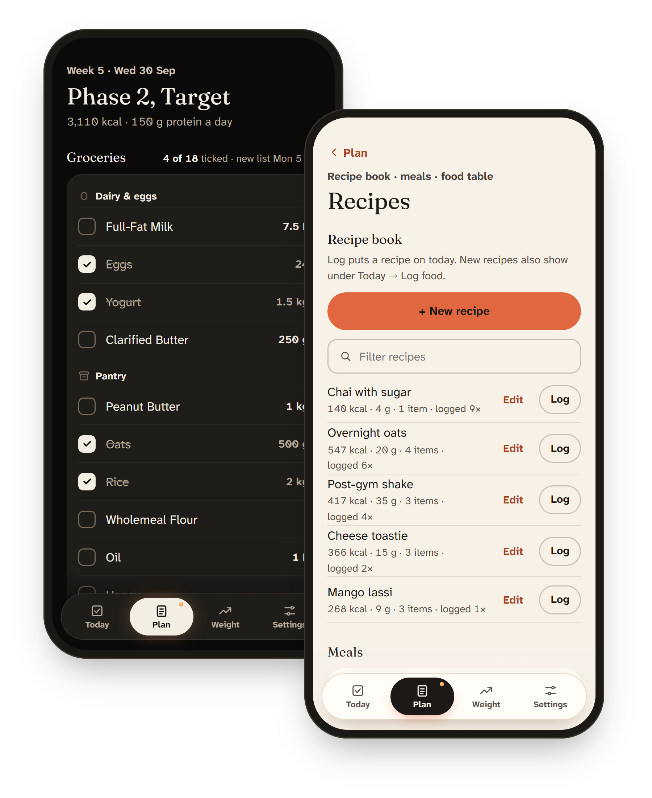

<div align="center">


# Rise

**The diet you planned, one tick at a time.**

Set your meals once. Each day, tick what you ate.<br />
Weigh in once a week, and see whether the plan is working.

[**Try it**](https://rvyyv-n.github.io/diet-tracker/) · [Download](https://github.com/rvyyv-n/diet-tracker/releases/latest) · [Roadmap](docs/roadmap.md) · [Changelog](docs/CHANGELOG.md)

[](https://github.com/rvyyv-n/diet-tracker/actions/workflows/test.yml)
[](https://github.com/rvyyv-n/diet-tracker/actions/workflows/pages.yml)
[](LICENSE)

</div>

[](https://rvyyv-n.github.io/diet-tracker/)

Food logging asks too much. You weigh everything, search for every item, and
most people give up within two weeks. Rise asks for one thing: you decide your
meals in advance, as **blocks**, and tick each one when you've eaten it. The
calories and protein are already worked out. Once a week you weigh in, and
Rise tells you plainly how the last four weeks went. If the plan needs to
change, it suggests how, and you decide.

**[Open the app](https://rvyyv-n.github.io/diet-tracker/)** and answer a few
questions to set up your plan. [Install it](#install) to use it as an app,
offline too. There's nothing to sign up for, and your data never leaves your
device.

> **Rise 3.0 is on its way.** These pictures show the new design, which is
> being built on the `release-3.0` branch. The live app and the downloads are
> still version 2.3 until it's released.

## Contents

- [What it does](#what-it-does)
- [Install](#install)
- [Privacy](#privacy)
- [How it's built](#how-its-built)
- [Development](#development)
- [License](#license)

## What it does

### Today



Today is your plan for the day, in time order. Tap a meal when you've eaten
it, and the total moves. A line marks where you are in the day.

- **Swap** a meal for another one from its rotation.
- **Add or drop** a block, just for today.
- **Log food** that wasn't in the plan, by name and calories, or from your
  recipes.
- **Say how hungry you were** with one tap. It helps the weekly review.
- **Look back** through the dots for the last week, or the calendar for any
  day. Past days stay closed, so the record stays honest.

<br clear="right" />

### Weight



Weigh in once a week, on any day. Rise draws the trend and compares the last
four weeks with your target, so one heavy morning doesn't count for much.

When the trend drifts, Today shows a suggestion: what to change, and why.
Apply it or dismiss it. Rise never changes your plan on its own.

<br clear="right" />

### Plan and recipes

<p align="center">
  
</p>

Plan holds your targets for each phase and turns the week's meals into a
grocery list you can tick off in the shop. Recipes keeps the meals you make
often, ready to log, beside every option in your plan.

### Made to be lived with

<p align="center">
  
</p>

- **Two Looks.** Paper is quiet and bookish; Reel is bold, like a film title.
  Each comes in light and dark, or follows your device.
- **Meal reminders**, if you want them, on Android, Windows and the web.
- **No nagging.** A missed meal is just a number. There are no streaks, no
  badges and no "you're behind".
- **Your own plan.** A short first run sets up your details and targets.
  Nothing personal is stored in this repo.

## Install

### Android

- **The Android app.** On your phone, download the APK from the
  [latest release](https://github.com/rvyyv-n/diet-tracker/releases/latest)
  and open it. The first time, Android asks you to allow installs from your
  browser: tap **Settings**, turn on **Allow from this source**, then go back
  and tap **Install**. It has native reminders and tells you when a new
  version is out.
- **From Chrome.** Open the
  [app](https://rvyyv-n.github.io/diet-tracker/), tap the **⋮** menu, then
  **Add to Home screen** and **Install**. It updates itself.

### iPhone and iPad

1. Open the [app](https://rvyyv-n.github.io/diet-tracker/) in **Safari**.
2. Tap **Share** (the square with an arrow), then **Add to Home Screen**, then
   **Add**.
3. Open Rise from its icon. It runs full screen and works offline.

Reminders on iOS only work once Rise is on the Home Screen. iOS can also clear
an unused web app's data after about a week, so Rise asks to keep its storage,
and **Settings → Export data** makes a backup.

### Computer

- **The Windows app.** Download the installer from the
  [latest release](https://github.com/rvyyv-n/diet-tracker/releases/latest)
  and run it. It isn't signed, so Windows may say **Windows protected your
  PC**: click **More info**, then **Run anyway**. It lives in the tray, can
  start with Windows and has native reminders.
- **Chrome or Edge.** Open the app and click **Install** at the right end of
  the address bar.
- **Safari on a Mac.** Open the app, then choose **File → Add to Dock**.

The Android and Windows apps check for a new release about once a week (or
from **Settings → Check for updates**) and link you to it. Each copy of Rise
keeps its own data. To move yours, use **Settings → Export data**, then
**Import data** on the other one.

## Privacy

Rise is local-first. Your plan, your ticks and your weights stay in your
browser's storage, on your device. There's no account, no server with your
data and no analytics. The fonts are bundled too.

Only two things use the network, and neither sends diet data:

- **The update check** asks GitHub for the latest version number.
- **Web reminders**, if you turn them on, go through a small server that
  keeps only a push address, your timezone and your meal times. The Android
  and Windows apps remind you from the device instead.

## How it's built

React 19 and Vite, as an installable, offline PWA. The Android app is a Kotlin
WebView shell, the Windows app is [Tauri](https://tauri.app/), and web
reminders go through a small Cloudflare Worker. The design comes from a design
handoff, with every value in [`src/css/tokens.css`](src/css/tokens.css) and
the reasoning in [`docs/design-system.md`](docs/design-system.md).

```
src/*.jsx         one component per screen, plus the app shell
src/components/   the shared components from the design handoff
src/js/core/      storage, the plan, day and weight models, and the trend and
                  suggestion engines: plain functions, no DOM
src/js/ui/        small shared controls: popover, listbox, date pickers, icons
src/css/          tokens.css, then the screen and component styles
public/           the manifest, the service worker, icons and fonts
android/          the Android shell and its reminders
desktop/          the Windows shell: tray, start with Windows, reminders
server/           the Cloudflare Worker for web reminders
e2e/              Playwright checks for offline use and for how screens look
docs/             roadmap, changelog, decisions, design system, plan spec
```

## Development

Needs Node 24.

```sh
npm install
npm run dev
```

Open the address Vite prints, then `dev-seed.html` on the same server to load
four weeks of demo data. Reminders show "unavailable" locally; that's
expected.

| Command                         | What it does                                                  |
| ------------------------------- | ------------------------------------------------------------- |
| `npm run dev`                   | Start the dev server                                          |
| `npm run build`                 | Build to `dist/`                                              |
| `npm run preview`               | Serve the build                                               |
| `npm run check`                 | Tests, ESLint, Prettier and the build                         |
| `npm run test:offline`          | Fail if anything but the update check leaves home             |
| `npm run test:visual`           | Compare screens with the approved pictures                    |
| `npm run shot`                  | Screenshot the app (options at the top of `scripts/shot.mjs`) |
| `node scripts/readme-shots.mjs` | Retake the pictures in this README (needs the dev server)     |

The service worker caches hard, so hard-reload while you work, or bump
`CACHE_NAME` in `public/sw.js`. The [Android](android/README.md),
[Windows](desktop/README.md) and [reminder server](server/README.md) folders
each have their own notes.

**Releases.** [`pages.yml`](.github/workflows/pages.yml) publishes the web
app to GitHub Pages, and [`test.yml`](.github/workflows/test.yml) checks every
push. Publishing a GitHub Release builds the
[APK](.github/workflows/android.yml) and the
[Windows installer](.github/workflows/desktop.yml). The reminder Worker is
deployed by hand.

## License

[MIT](LICENSE) © rvyyv-n
