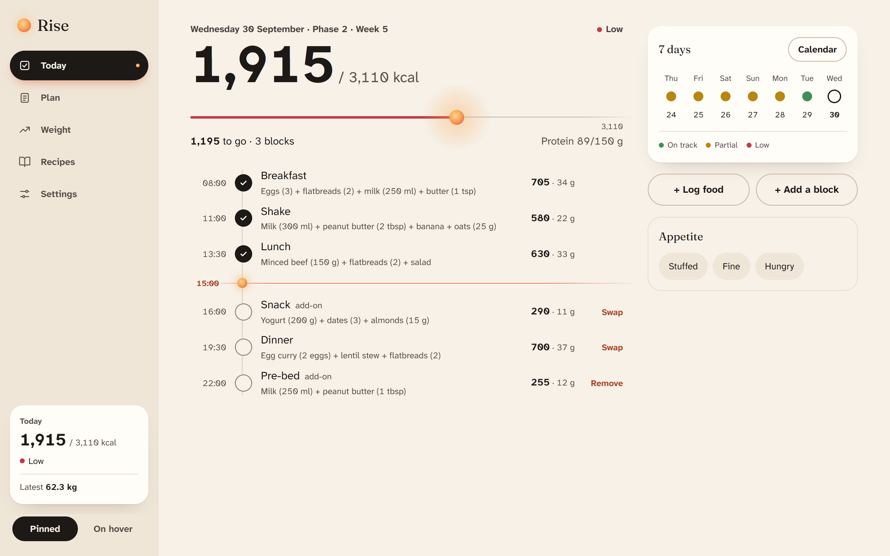
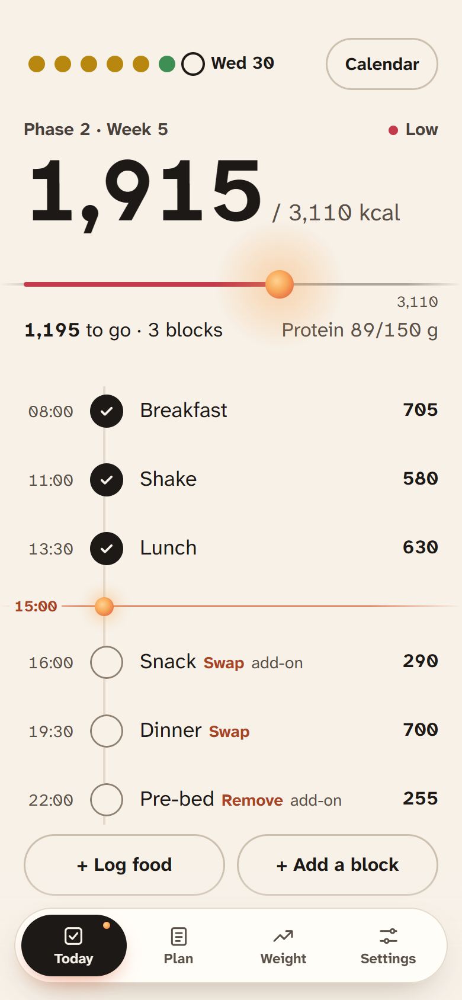
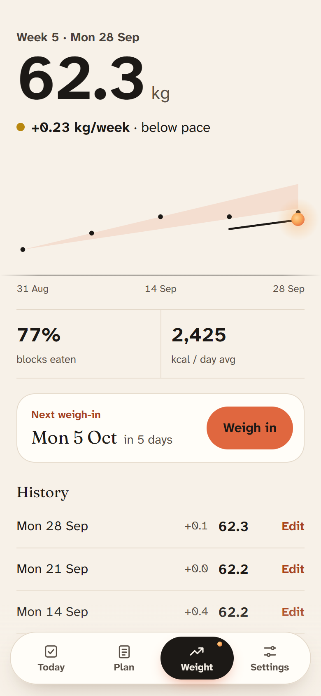
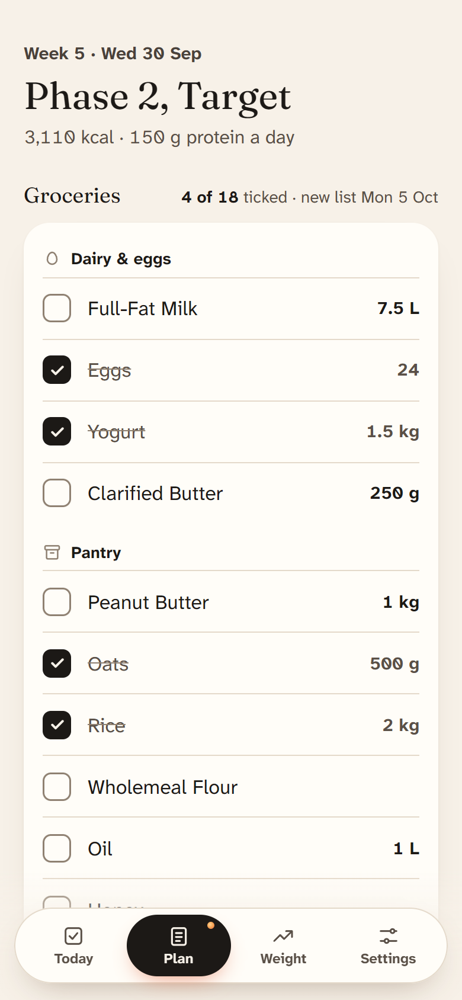
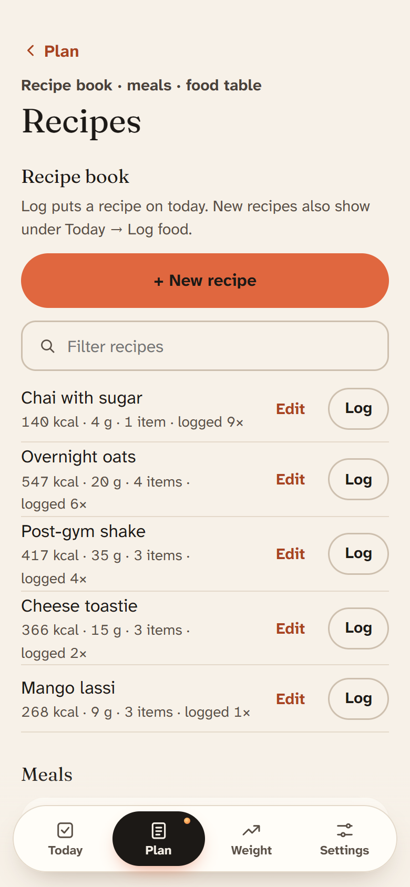
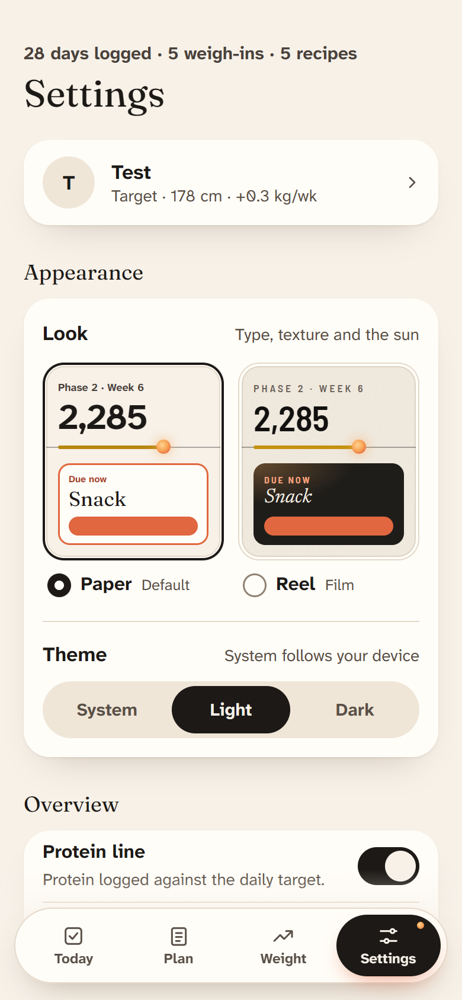
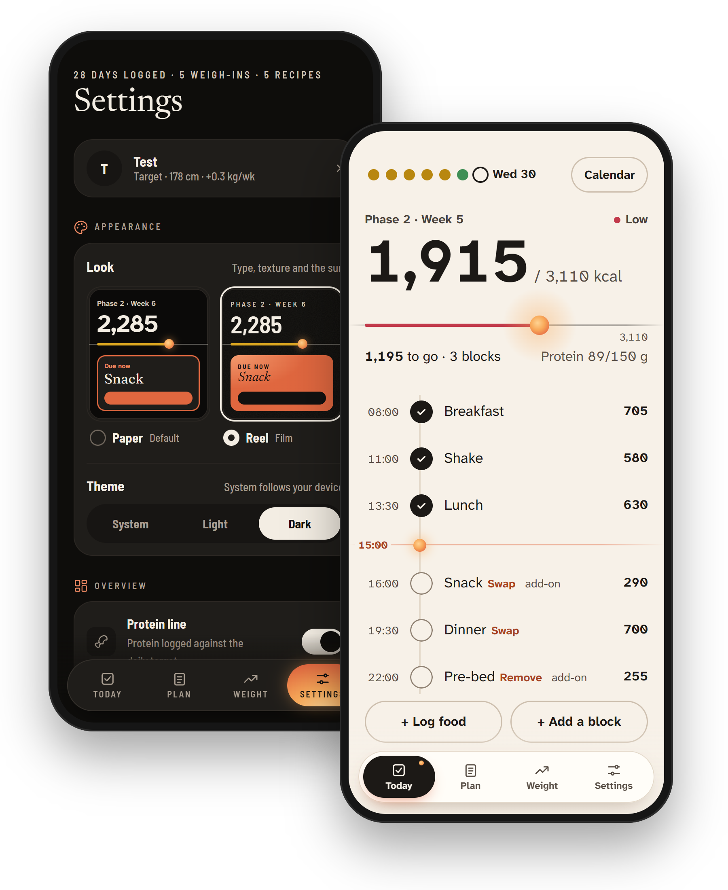

<div align="center">


# Rise

**A diet plan you tick, not a food log.**

Plan your meals once as blocks, then tick the ones you ate.<br />
A weekly weigh-in shows whether the plan is working.

[**Try it**](https://rvyyv-n.github.io/diet-tracker/) · [Download](https://github.com/rvyyv-n/diet-tracker/releases/latest) · [Roadmap](docs/roadmap.md) · [Changelog](docs/CHANGELOG.md) · [Design system](docs/design-system.md)

[](https://github.com/rvyyv-n/diet-tracker/actions/workflows/test.yml)
[](https://github.com/rvyyv-n/diet-tracker/actions/workflows/pages.yml)
[](LICENSE)

</div>

[](https://rvyyv-n.github.io/diet-tracker/)

Most diet apps ask you to weigh and log everything you eat, and most people
stop within a fortnight. Rise turns that around. Your plan is fixed in advance
as meal **blocks**, and the only daily action is ticking the ones you ate.
Calories and protein come from the blocks, so you never log an ingredient. A
weekly weigh-in feeds a four-week average, and Rise _suggests_ changes to the
plan. It never makes them for you.

**[Open the app](https://rvyyv-n.github.io/diet-tracker/)** and answer a few
questions to set up your plan. [Install it](#install) on your phone or computer
to use it as an app, offline too. There's nothing to sign up for.

> **Status:** v3.0, the design overhaul, is being built on the `release-3.0`
> branch, and the screenshots here show it. The live site and the downloads are
> still **v2.3.0** until v3.0 is released.

## Contents

- [Install](#install)
- [Features](#features)
- [Privacy](#privacy)
- [How it's built](#how-its-built)
- [Development](#development)
- [Deployment](#deployment)
- [License](#license)

## Install

### Android

- **The Android app.** Download the APK from the
  [latest release](https://github.com/rvyyv-n/diet-tracker/releases/latest) on
  your phone and open it. Android asks you to allow installs from your browser
  the first time: tap **Settings**, turn on **Allow from this source**, then go
  back and tap **Install**. It has native meal reminders, and it tells you when
  a new version is out.
- **From Chrome.** Open
  [rvyyv-n.github.io/diet-tracker](https://rvyyv-n.github.io/diet-tracker/), tap
  the **⋮** menu, then **Add to Home screen** and **Install**. It updates
  itself.

### iPhone and iPad

1. Open [rvyyv-n.github.io/diet-tracker](https://rvyyv-n.github.io/diet-tracker/)
   in **Safari**. Only Safari can add a web app to the Home Screen on iOS.
2. Tap the **Share** button (the square with an arrow), then **Add to Home
   Screen**, then **Add**.
3. Open Rise from its icon. It opens full screen and works offline.

Meal reminders on iOS need this step, because Safari only sends web
notifications to an app on the Home Screen. iOS can also clear an unused web
app's storage after about a week. Rise asks the browser to keep its storage,
and **Settings → Export data** is the manual backup.

### Computer

- **The Windows app.** Download the installer from the
  [latest release](https://github.com/rvyyv-n/diet-tracker/releases/latest) and
  run it. It isn't signed, so Windows may say **Windows protected your PC**:
  click **More info**, then **Run anyway**. It sits in the tray, can start with
  Windows, and has native meal reminders.
- **Chrome or Edge.** Open the site and click the **Install** icon at the right
  end of the address bar.
- **Safari on a Mac.** Open the site, then choose **File → Add to Dock**.

The Android and Windows apps don't update in place. They check GitHub for a
newer release (at most weekly, or from **Settings → Check for updates**) and
link you to it. Your data stays on the device and browser you saved it in. To
move it, use **Settings → Export data** and **Import data** on the other one.

## Features

<p>
  
  
  
  
  
</p>

### Every day

- **Tick, don't log.** Today shows the day's meal blocks. Tap one when you've
  eaten it, and the running calories and protein update. Swap a meal for
  another option in its rotation, or add or drop a block for the day.
- **Off-plan food.** Ate something else? Log it by name and calories, or pick
  it from your recipe book.
- **A quick appetite check.** One tap records how hungry you were. It feeds
  the plan suggestions.
- **Past days stay closed.** Reach the last week through the dot strip, or any
  day through the calendar. Looking back never reopens a day for editing.

### Every week

- **Weigh in.** Add a weight for any date. Rise draws the trend and compares
  the four-week change with your target.
- **Suggestions, not changes.** When the trend drifts, Rise suggests a change
  to the plan with the reason beside it. Apply it or dismiss it. Nothing
  changes on its own.
- **A grocery list.** Plan turns the week's blocks into a checklist.

### Your way

- **Two Looks.** Paper is calm and bookish. Reel is bold and warm. Each has
  light and dark, or follows your system.
- **Meal reminders** on Android, Windows and the web, if you want them.
- **It never nags.** A missed block is a number, not a guilt trip. There are no
  streaks and no praise.
- **A short setup.** First run asks for your details and sets up your plan.
  Nothing personal is in this repo.



## Privacy

Rise is local-first. Your plan, ticks and weights live in your browser's
storage on your device. There's no account, no server holding your data and no
analytics. The fonts are bundled, so the app makes no other requests.

Only two things ever use the network, and neither sends diet data:

- **The update check** asks the GitHub API for the latest version, at most
  weekly or when you tap it.
- **Web meal reminders**, if you turn them on, go through a small server that
  stores only a push address, a timezone and your meal times. The Android and
  Windows apps send reminders on the device instead.

## How it's built

React 19 and Vite, installable as a PWA, with no backend for diet data. The
Android app is a Kotlin WebView shell, the Windows app is
[Tauri](https://tauri.app/), and web reminders go through a small Cloudflare
Worker.

```
src/*.jsx         one React component per screen, plus the app shell
src/components/   the shared component set from the design handoff
src/js/core/      storage, profile, the plan, day and weight models, the trend
                  and adjustment engines: all pure, no DOM
src/js/ui/        small shared controls (popover, listbox, date pickers, icons)
src/css/          design tokens (tokens.css), then the screen and component styles
public/           manifest.json, sw.js, the app icons and the bundled fonts
android/          the Android shell and its native reminders
desktop/          the Tauri desktop shell: tray, start with Windows, reminders
server/           the Cloudflare Worker behind web push reminders
e2e/              Playwright checks: offline and visual
docs/             roadmap, changelog, decisions, design system and plan spec
```

The look comes from a design handoff. Its tokens live in
[`src/css/tokens.css`](src/css/tokens.css) and are explained in
[`docs/design-system.md`](docs/design-system.md). Every screen is checked in
both Looks, light and dark, from 320px phones to desktop, for contrast and 44px
targets.

## Development

Needs Node 24.

```sh
npm install
npm run dev
```

Then open the address Vite prints. `file://` won't work, because ES modules need
http. Open `dev-seed.html` through the dev server to load four weeks of demo
data. Reminders show "unavailable" in local builds; that's expected.

| Command                | What it does                                                 |
| ---------------------- | ------------------------------------------------------------ |
| `npm run dev`          | Start the dev server                                         |
| `npm run build`        | Build to `dist/`                                             |
| `npm run preview`      | Serve the production build                                   |
| `npm test`             | Run the Vitest suite                                         |
| `npm run lint`         | ESLint                                                       |
| `npm run format`       | Prettier                                                     |
| `npm run check`        | Tests, ESLint, the Prettier check and the build              |
| `npm run test:offline` | Fail if any request leaves localhost or a font is missing    |
| `npm run test:visual`  | Compare screens with the approved pictures                   |
| `npm run shot`         | Screenshot the running app (options atop `scripts/shot.mjs`) |

The service worker caches hard. While developing, hard-reload, or bump
`CACHE_NAME` in `public/sw.js` to pick up changes. The native shells have their
own notes in [`android/README.md`](android/README.md) and
[`desktop/README.md`](desktop/README.md), and the reminder server in
[`server/README.md`](server/README.md).

## Deployment

The web app lives at
**[rvyyv-n.github.io/diet-tracker](https://rvyyv-n.github.io/diet-tracker/)**.
[`pages.yml`](.github/workflows/pages.yml) builds and deploys it to GitHub
Pages, and [`test.yml`](.github/workflows/test.yml) runs the tests and a build
on every push.

Publishing a GitHub Release builds the Android APK
([`android.yml`](.github/workflows/android.yml)) and the Windows installer
([`desktop.yml`](.github/workflows/desktop.yml)) and attaches them to it. The
reminder Worker in `server/` is deployed by hand.

## License

[MIT](LICENSE) © rvyyv-n
